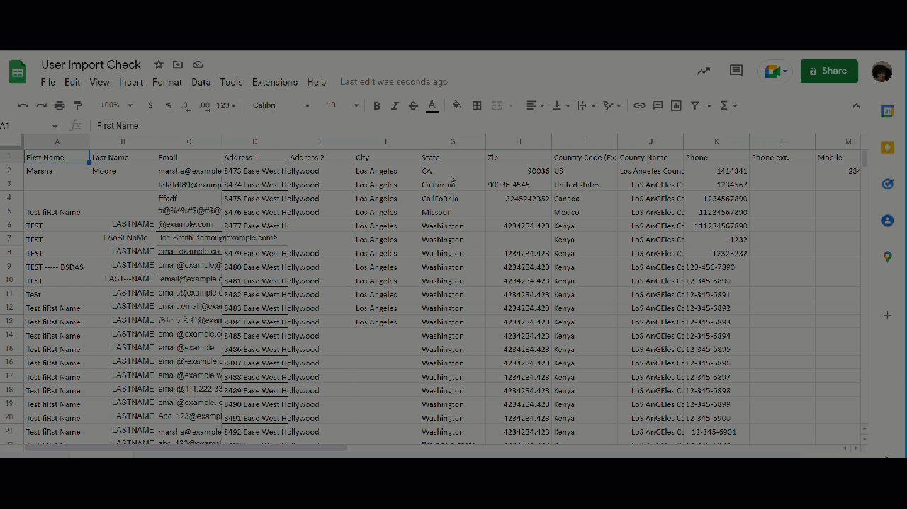
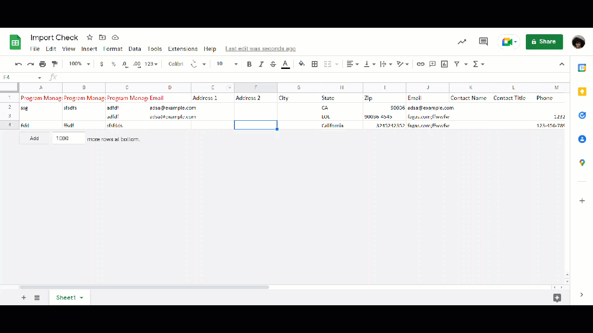

# Import Template Checker

Are you a Data Specialist who's been tasked with checking import templates for clients? Wouldn't it be nice if a robot friend went ahead and did most of the ground work for you, leaving you with very little to check? Well look no further! I created this script to assist Galaxy Digital Data Specialists with checking clients' import templates, by automating the process.

**Link to download add-on (GD Employees Only):** https://workspace.google.com/marketplace/app/import_template_checker/411770798065 
**Link to how-to-use-checker documentation:** https://docs.google.com/document/d/1hiM0OKJjz4v8_APiDp_DMDcHhEulp79jSFUQ8o6yhSg/

## How It's Made:
I used Google's App Script language and API to write methods that perform the core template checks whenever triggred by the press of a button. I used OOP to organize my code by creating a general template class and additional template classes for each type of template that needs to be checked. Each class contains the properties and methods needed by the templates to perform their checks, and methods are shared between templates by utilizing superclasses and subclasses. 

 

## **Please Note:** 
The files within this repo are grouped logically within folders, however, Google App Script makes each file within a main script's variables and functions available to each other. This means within the App Script development environment, each file within this repo would not be contained in a folder, and no import or export statements would be needed in order to share the variables and functions between each file. Additionally, the .js files would all have an extension of .gs. 

To read more about creating a custom Google Sheets add-on, please refer to [Google's documentation here](https://developers.google.com/apps-script/add-ons/editors/sheets).
 

## Optimizations
<ul>
  <li>De-duplicated code and made the checks more user-friendly by storing the potential titles of columns that need to be checked within an array, and having their check methods iterate through the potential titles within the array so that if multiple columns that need the same check are present, they are not missed, and this lets user not have to worry about varied columns titles. Additionally, through implementing this, I was able to remove multiple methods that performed checks based on a specific column title, and apply one method to all columns that contain certain header titles. </li>
  <li>After originally writing custom methods to perform the duplicate email check and white-space removal check, I re-wrote the methods to utilze Google Sheet's COUNTIF and trim functions. This improved the speed of the script and lowered the memory needed to run the script.</li>
  <li>Handled the case where users do not have a Hours Type columns within the Individual Hours Template. Now, the script will either override, fillt the columns with the word 'Individual', or it will insert a new column that does so if an 'Hours Type' column is not already present. This no longer causes error comments to be overriden within the main sheet.
  </li>
  <li>Updated the script files to be better organized, so the code it easier for other to manage
  </li>
  <li>Updated the User Groups import template check script to ensure a group title is provided if there is data within any of the optional columns, instead of just some of them
  </li>
  <li>Updated the removeHeaderComments method to use a while loop instead of the forEach method to help make code more intuitive and logical
  </li>
</ul>

## Lessons Learned:
<ul>
  <li>Though writing custom methods for each task provides much creative freedom, it's important to keep the memory needed for the script, and the performance of the script in mind so that it is able to work effectivley for small data sets as well as large data sets.</li>
  <li>I learned of the importance of organization of code, and once my code was organized and OOP was fully implemented, I was allowed to seamlessly update methods, fix bugs, and add features to multiple checks at a time without having to duplicate methods.</li>
  <li>Additionally, user experience should aslo be kept at the forefront of the mind, and it's important to know when to put in some additional work in order to ensure the product can be used by others without headache.</li>
  <li>It's important to be intentional about de-duplicating code as soon as possible so that there are not multiple methods the need to be updated in order to do so. Keeping code dry helps optimize space complexity and also makes the application more scalable and easy for others to understand.
  </li>
  <li>It's also important to keep an eye out for any variables that are being used by multiple methods, so that instead of re-declaring them and taking up additional space, they can be available to all methods needed. This also makes the application more scalable and maintainable in the case a variable name or value needs to be changed
  </li>
  <li>Lastly, at first I gave each sheet checked a custom name based on the type of check being ran (user template checks would get a sheet name of "User" and report sheet name of "User Report"). Though this was helpful, it would cause errors if a user needed to run multiple of the same type checks within the same spreadsheet (i.e. one user template has 50,000 rows so the user splits it up into 5 separate sheets, and runs checks on each of these sheets within the same spreadsheet). I ended up changing this, and keeping each original sheet name the same, and adding "Report" to the end of the sheet name for the report sheet. This enables users to run the same type of check for different sheets within the same spreadsheet.</li>
</ul>
    
